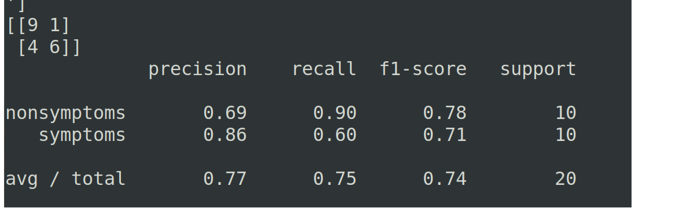
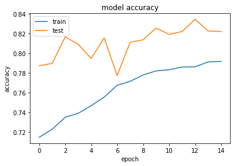
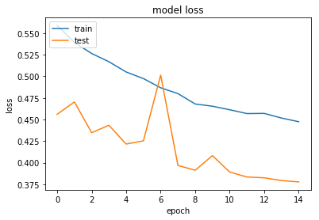

# diabetic-retinopathy

This is a project for creating a webb app that can classify retina images if it has diabetic retinopathy or not.
This was developed as a part of a 24 hour hackathon, [Hacktory](http://hacktory.in/register).

### Requirements
####  For Web app

1. Python.
2. Keras with tensorflow backend.
3. Django

####  For Training and customization 
With the above requirements,

1. Numpy
2. Pandas
3. Scikit-Learn
4. Matplotlib
5. Jupyter Notebook

### Installation

#### For running the web app.

1. Clone this repository
2. Go to diabetic-retinopathy/website/
3. Run 'python3 manage.py runserver'
4. Go to localhost/eye in your browser.

#### For training the model and customizing.

1. Clone the repository
2. Download the dataset, either the [subset](https://github.com/Nomikxyz/retinopathy-dataset) or the [entire dataset](https://www.kaggle.com/c/diabetic-retinopathy-detection/data).
3. Arrange the dataset into Symptoms and Non Symptoms according to Keras [ImageDataGenerator](https://keras.io/preprocessing/image/).
4. Run the Jupyter notebook.
5. Model will be saved as model.hd5.

Alternatively, you can use our pretrained model by loading the model.hd5.

### Results

The training converged to an accuracy of about 80%. With the validation scores for a small test set generated as,

The training data was generated as, 
<table style='margin:0px'><tr><td></td><td></td></tr></table>

Since we used the subset of our dataset(scaled down to 64*64) for faster training, we had some limitations in getting higher accuracy. Also using advanced architectures like the [inception v3](https://arxiv.org/abs/1512.00567) will boost up our accuracy and help predicting with minimised True negatives.